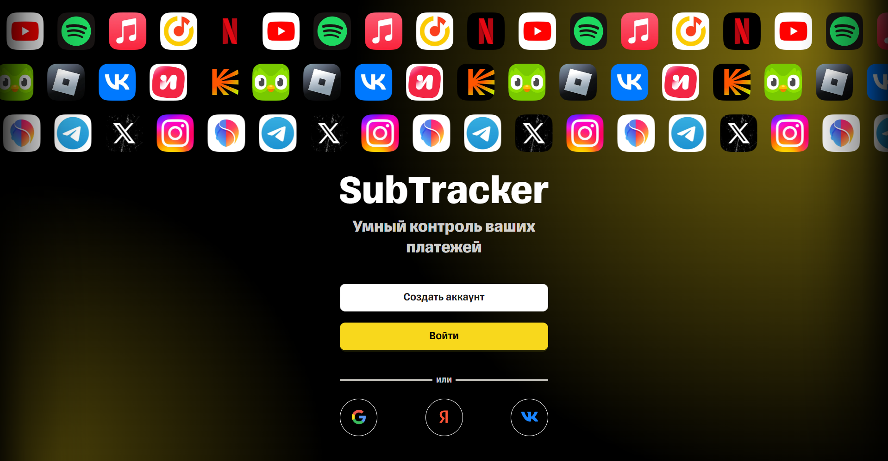
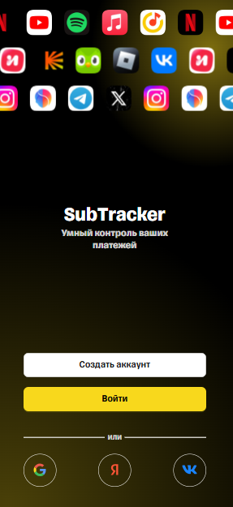

# **SubTracker** - __Контроль и управление вашими подписками__


## Возможности

 - Управление подписками (обычные и кастомные)
 - Календарь платежей
 - Статистика расходов
 - Напоминания о списаниях
 - Поддержка двух языков (русский/английский)
 - PWA — установка на телефон


## Просмотр
[Посмотреть на GitHub Pages](https://aydik.github.io/subtracker)

## Установка и запуск

### 1. Клонирование репозитория

```bash
git clone https://github.com/Aydik/subtracker.git
```

### 2. Установка зависимостей

```bash
npm install
```

### 3. Запуск в режиме разработки

```bash
npm run dev
```

Приложение будет доступно по адресу: http://localhost:5173

## Технологии и стек

 - React 18 + TypeScript
 - Redux Toolkit + RTK Query
 - Vite
 - Ant Design
 - i18next
 - VitePWA
 - FSD (Feature-Sliced Design)

## Скриншоты

### Десктопная версия



### Мобильная версия
